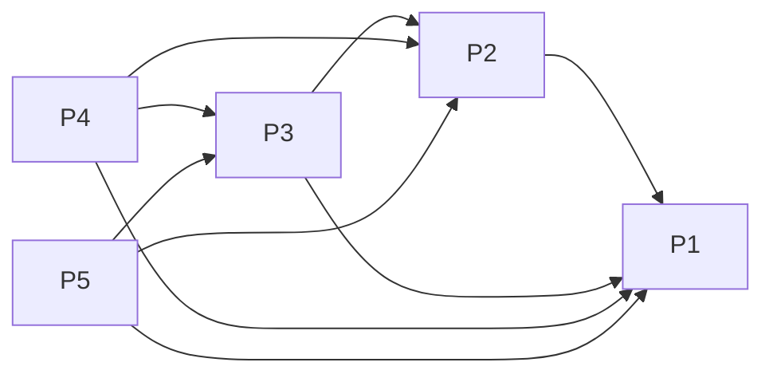

# Projects and dependencies analysis

This document provides a comprehensive overview of the projects and their dependencies in the context of upgrading to .NETCoreApp,Version=v8.0.

## Table of Contents

- [Executive Summary](#executive-Summary)
  - [Highlevel Metrics](#highlevel-metrics)
  - [Projects Compatibility](#projects-compatibility)
  - [Package Compatibility](#package-compatibility)
  - [API Compatibility](#api-compatibility)
- [Aggregate NuGet packages details](#aggregate-nuget-packages-details)
- [Top API Migration Challenges](#top-api-migration-challenges)
  - [Technologies and Features](#technologies-and-features)
  - [Most Frequent API Issues](#most-frequent-api-issues)
- [Projects Relationship Graph](#projects-relationship-graph)
- [Project Details](#project-details)

  - [BuergerPortal.Business/BuergerPortal.Business.csproj](#buergerportalbusinessbuergerportalbusinesscsproj)
  - [BuergerPortal.Data/BuergerPortal.Data.csproj](#buergerportaldatabuergerportaldatacsproj)
  - [BuergerPortal.Domain/BuergerPortal.Domain.csproj](#buergerportaldomainbuergerportaldomaincsproj)
  - [BuergerPortal.Tests/BuergerPortal.Tests.csproj](#buergerportaltestsbuergerportaltestscsproj)
  - [BuergerPortal.Web/BuergerPortal.Web.csproj](#buergerportalwebbuergerportalwebcsproj)

## Executive Summary

### Highlevel Metrics

| Metric | Count | Status |
| :--- | :---: | :--- |
| Total Projects | 5 | All require upgrade |
| Total NuGet Packages | 14 | 5 need upgrade |
| Total Code Files | 59 |  |
| Total Code Files with Incidents | 7 |  |
| Total Lines of Code | 1926 |  |
| Total Number of Issues | 27 |  |
| Estimated LOC to modify | 0+ | at least 0.0% of codebase |

### Projects Compatibility

| Project | Target Framework | Difficulty | Package Issues | API Issues | Est. LOC Impact | Description |
| :--- | :---: | :---: | :---: | :---: | :---: | :--- |
| [BuergerPortal.Business/BuergerPortal.Business.csproj](#buergerportalbusinessbuergerportalbusinesscsproj) | net462 | 🟢 Low | 0 | 0 |  | ClassicClassLibrary, Sdk Style = False |
| [BuergerPortal.Data/BuergerPortal.Data.csproj](#buergerportaldatabuergerportaldatacsproj) | net462 | 🟢 Low | 2 | 0 |  | ClassicClassLibrary, Sdk Style = False |
| [BuergerPortal.Domain/BuergerPortal.Domain.csproj](#buergerportaldomainbuergerportaldomaincsproj) | net462 | 🟢 Low | 0 | 0 |  | ClassicClassLibrary, Sdk Style = False |
| [BuergerPortal.Tests/BuergerPortal.Tests.csproj](#buergerportaltestsbuergerportaltestscsproj) | net462 | 🟢 Low | 2 | 0 |  | ClassicClassLibrary, Sdk Style = False |
| [BuergerPortal.Web/BuergerPortal.Web.csproj](#buergerportalwebbuergerportalwebcsproj) | net462 | 🟢 Low | 11 | 0 |  | ClassicClassLibrary, Sdk Style = False |

### Package Compatibility

| Status | Count | Percentage |
| :--- | :---: | :---: |
| ✅ Compatible | 9 | 64.3% |
| ⚠️ Incompatible | 3 | 21.4% |
| 🔄 Upgrade Recommended | 2 | 14.3% |
| ***Total NuGet Packages*** | ***14*** | ***100%*** |

### API Compatibility

| Category | Count | Impact |
| :--- | :---: | :--- |
| 🔴 Binary Incompatible | 0 | High - Require code changes |
| 🟡 Source Incompatible | 0 | Medium - Needs re-compilation and potential conflicting API error fixing |
| 🔵 Behavioral change | 0 | Low - Behavioral changes that may require testing at runtime |
| ✅ Compatible | 758 |  |
| ***Total APIs Analyzed*** | ***758*** |  |

## Aggregate NuGet packages details

| Package | Current Version | Suggested Version | Projects | Description |
| :--- | :---: | :---: | :--- | :--- |
| Antlr | 3.4.1.9004 |  | [BuergerPortal.Web.csproj](#buergerportalwebbuergerportalwebcsproj) | Needs to be replaced with Replace with new package Antlr4=4.6.6 |
| Castle.Core | 3.3.3 | 5.2.1 | [BuergerPortal.Tests.csproj](#buergerportaltestsbuergerportaltestscsproj) | ⚠️NuGet package is incompatible |
| EntityFramework | 6.4.4 | 6.5.1 | [BuergerPortal.Data.csproj](#buergerportaldatabuergerportaldatacsproj) [BuergerPortal.Web.csproj](#buergerportalwebbuergerportalwebcsproj) | NuGet package upgrade is recommended |
| jQuery | 3.7.1 |  | [BuergerPortal.Web.csproj](#buergerportalwebbuergerportalwebcsproj) | ✅Compatible |
| jQuery.Validation | 1.21.0 |  | [BuergerPortal.Web.csproj](#buergerportalwebbuergerportalwebcsproj) | ✅Compatible |
| Microsoft.AspNet.Mvc | 4.0.40804.0 |  | [BuergerPortal.Web.csproj](#buergerportalwebbuergerportalwebcsproj) | NuGet package functionality is included with framework reference |
| Microsoft.AspNet.Razor | 2.0.30506.0 |  | [BuergerPortal.Web.csproj](#buergerportalwebbuergerportalwebcsproj) | NuGet package functionality is included with framework reference |
| Microsoft.AspNet.Web.Optimization | 1.1.3 |  | [BuergerPortal.Web.csproj](#buergerportalwebbuergerportalwebcsproj) | ⚠️NuGet package is incompatible |
| Microsoft.AspNet.WebPages | 2.0.30506.0 |  | [BuergerPortal.Web.csproj](#buergerportalwebbuergerportalwebcsproj) | NuGet package functionality is included with framework reference |
| Microsoft.jQuery.Unobtrusive.Validation | 4.0.0 |  | [BuergerPortal.Web.csproj](#buergerportalwebbuergerportalwebcsproj) | ✅Compatible |
| Microsoft.Web.Infrastructure | 1.0.0.0 |  | [BuergerPortal.Web.csproj](#buergerportalwebbuergerportalwebcsproj) | NuGet package functionality is included with framework reference |
| Moq | 4.2.1510.2205 | 4.20.72 | [BuergerPortal.Tests.csproj](#buergerportaltestsbuergerportaltestscsproj) | ⚠️NuGet package is incompatible |
| Newtonsoft.Json | 5.0.4 | 13.0.4 | [BuergerPortal.Web.csproj](#buergerportalwebbuergerportalwebcsproj) | NuGet package upgrade is recommended |
| WebGrease | 1.6.0 |  | [BuergerPortal.Web.csproj](#buergerportalwebbuergerportalwebcsproj) | ✅Compatible |

## Top API Migration Challenges

### Technologies and Features

| Technology | Issues | Percentage | Migration Path |
| :--- | :---: | :---: | :--- |

### Most Frequent API Issues

| API | Count | Percentage | Category |
| :--- | :---: | :---: | :--- |

## Projects Relationship Graph

Legend:
📦 SDK-style project
⚙️ Classic project

## Project Details

